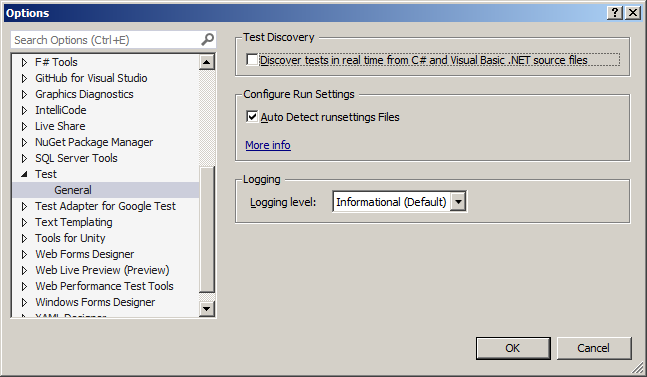
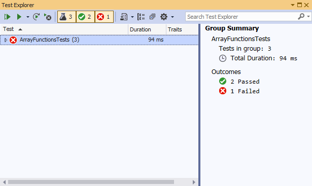
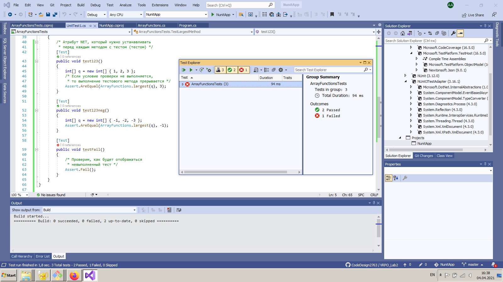

# ЛР №2 "Модульное тестирование при помощи NUnit"

## Задание

Microsoft Visual Studio Community 2019. Дан метод `int largest(int[] a)`, который определяет максимальный элемент целочисленного массива типа `int`. Необходимо разработать для него тесты при помощи среды `NUnit` (версия 3).

## Полезные справочные материалы

Статьи:
[Learning NUnit In Easy Way For Beginners](http://learnseleniumtesting.com/learning-nunit-in-easy-way-for-beginners/)

Видео на YouTube: 
[C# Unit Tests Using NUnit](https://www.youtube.com/watch?v=uvqAGchg8bc)

## Алгоритм выполнения

1. Создать проект, в котором будет реализован [класс](./NunitApp/ArrayFunctions.cs) с упомянутым выше методом. В данном случае - `NunitApp`.
2. Добавить в **Solution** еще один проект, указав тип `NUnit 3 Test Project` (в данном случае - `ArrayFunctionsTest`). В нем будут содержаться тесты для упомянутого выше метода.
3. Добавить в проект с тестами ссылку на проект с методом, который мы будем тестировать: правый клик по разделу **Dependencies** проекта `ArrayFunctionsTests`, затем **Add project reference/Projects** и указать `NunitApp`.
4. Импортировать в класс с тестами класс, который мы будем тестировать, при помощи директивы `using`.
5. Написать код тестов в проекте с тестами используя атрибуты NET `[TestFixture]`, `[Test]` и класс `Assert` (см. [код](./ArrayFunctionsTests/UnitTest1.cs)).
6. При необходимости обновить пакеты в классе с тестами (кликнув по ним правой кнопкой мыши и выбрав соответствующий пункт в меню).
7. Скомпилировать и собрать **Solution**.
8. Выбрать пункт **Run all tests** в меню **Test**. 

Если после удаления проекта с *другими тестами* они по-прежнему присутствуют в **Test Exporer**, то нужно убрать галочку с пункта `Discover tests in real time` в окне настройки тестов, попасть в которое можно при помощи **Tests/Options**.

## Результат

